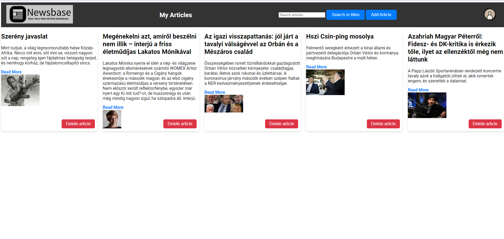
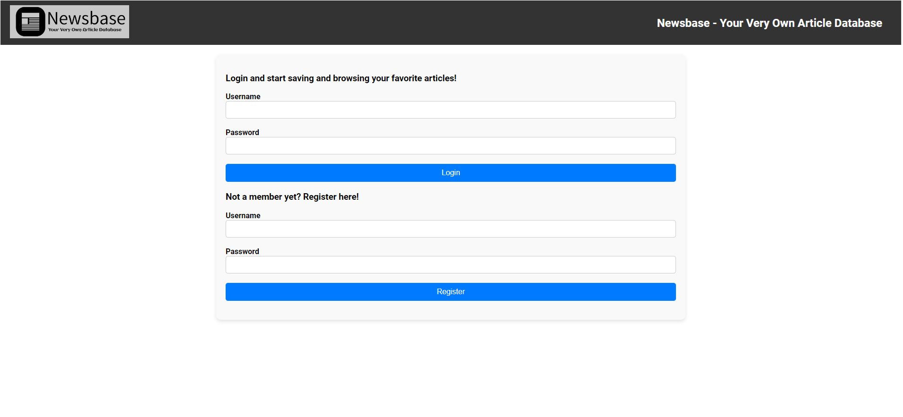
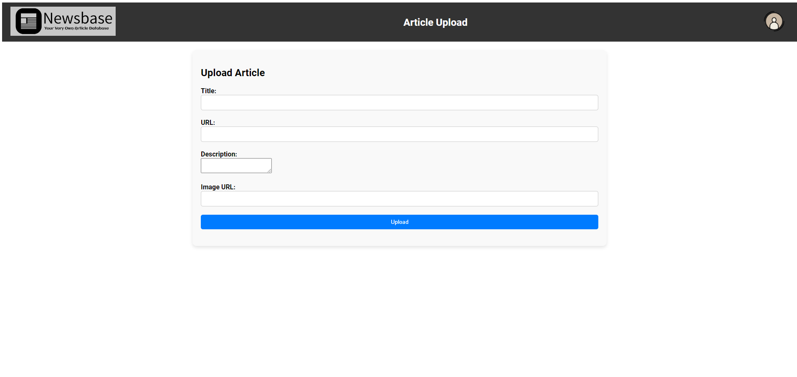
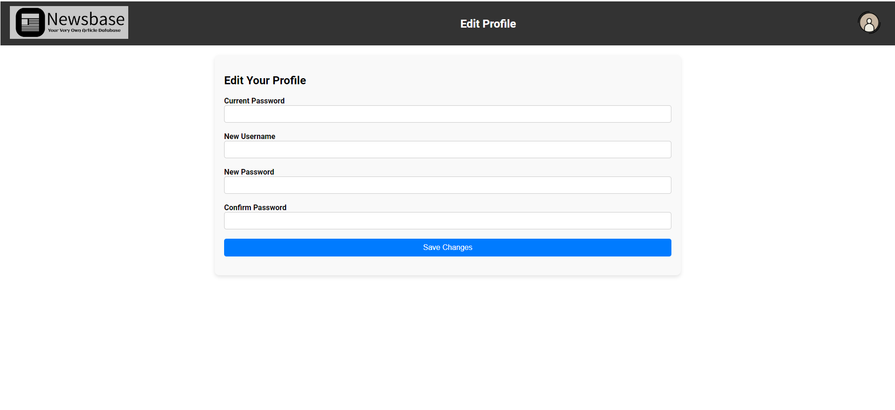
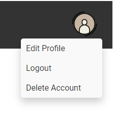

<h1 align="center">Newsbase</h1>

  <p align="center">
  <a href="https://github.com/ori-123/newsbase">
    
  </a>
  </p>

<h2 id="about-the-project">About The Project</h2>

Newsbase is a place to easily store a user's favorite articles with their URLs, titles, short descriptions
and images. Registered users can save their articles to a MySQL database and later query them in a list
or remove them. Users may change their username or password and even completely delete their account.

This project was done as a small test regarding a job opportunity at <a href="https://delocal.hu/">Delocal Zrt.</a>

The point was to complete the task in a limited amount of time, without the aid of major backend or frontend frameworks like Laravel,
React, Vue etc.



<p></p>

<details>
    <summary>More screenshots</summary>
    <p></p>
    <p></p>
    <p></p>
    <p></p>
</details>
<details>
  <summary>Table of Contents</summary>
  <ol>
    <li>
      <a href="#about-the-project">About The Project</a>
      <ul>
        <li><a href="#built-with">Built With</a></li>
        <li><a href="#implemented-features">Implemented features</a></li>
      </ul>
    </li>
    <li><a href="#getting-started">Getting Started</a></li>
    <li><a href="#contributing">Contributing</a></li>
    <li><a href="#contact-author">Contact Authors</a></li>
  </ol>
</details>

<h3 id="built-with">Built With</h3>

* [![PHP][PHP]][PHP-url]
* [![MySQL][MySQL]][MySQL-url]
* [![Javascript][Javascript]][Javascript-url]
* [![CSS][CSS]][CSS-url]

<p align="right">(<a href="#about-the-project">back to top</a>)</p>

<h2 id="getting-started">Getting Started</h2>

<h3 id="prerequisites">Prerequisites</h3>

* PHP 8.1
* Composer
* MySQL
* Apache

There are multiple ways to run the application, this is one sequence:

1. Create local MySQL database in preferred manner
2. Clone repo to Apache htdocs' `newsbase` folder
3. Inside the `backend` folder: `composer install` and `composer update` for good measure
4. Set database connection and request origin (where you run the frontend, if you follow this sequence it's just http://localhost)
   details in `config/.env.example` to desired values, copy and paste it <b>in the same folder</b> and rename it to `.env`
5. Run `newsbase/backend/create_table.sql`
6. You can run `npm install` in the frontend folder (you'll need node package manager for this), but there are no dependencies,
   it's only metadata.
7. You can use PHP's built-in webserver to run the backend: `php -S localhost:8000`. You _can_ change the port, but for simplicity's
   sake and to allow for not using any serious frontend frameworks and bundles, it _is_ hardcoded in the fetches, so you'll have
   to change those also in the script files. So recommend sticking with 8000.
8. Start Apache server (`httpd.exe -k start` on Windows machines)
9. Open `http://localhost/newsbase/frontend/public_html/index.html` or `http://localhost/newsbase/public_html/index.php` in
   a browser.

<p align="right">(<a href="#about-the-project">back to top</a>)</p>

<h2 id="implemented-features">Implemented features</h2>

### Backend:

1. User registration
2. User login
3. User authentication and authorization with sessions
4. User CRUD
5. Article CRUD
6. Persistence
7. Logging (Logfile: `newsbase/backend/logs/backend_logs.log`)

### Frontend:

1. User signup
2. User login
3. User logout
4. Delete account
5. User dashboard
6. Change username and/or password
7. Article save form
8. Article deletion
9. Article search in titles
10. Logging (Logfile: `newsbase/backend/logs/frontend_logs.log`)
11. CSS styling, logos, icons

<p align="right">(<a href="#about-the-project">back to top</a>)</p>

<h2 id="contributing">Contributing</h2>

Contributions are what make the open source community such an amazing place to learn, inspire, and create. Any
contributions you make are **greatly appreciated**.

If you have a suggestion that would make this application better, please fork the repo and create a pull request.

1. Fork the Project
2. Create your Feature Branch (```git checkout -b feature/AmazingFeature```)
3. Commit your Changes (`git commit -m 'Add some AmazingFeature'`)
4. Push to the Branch (`git push origin feature/AmazingFeature`)
5. Open a Pull Request

<p align="right">(<a href="#about-the-project">back to top</a>)</p>

<h2 id="contact-author">Contact Author</h2>

### Oresztész Fokasz (Ori)

[![Github Pages]](https://github.com/ori-123/)
[![LinkedIn]](https://www.linkedin.com/in/ori-fokas/)
[![Gmail]](mailto:fokaszo@gmail.com)

<p align="right">(<a href="#about-the-project">back to top</a>)</p>

<!-- MARKDOWN LINKS & IMAGES -->

[PHP]: https://img.shields.io/badge/PHP-777BB4?style=for-the-badge&logo=php&logoColor=white
[PHP-url]: https://www.php.net/
[MySQL]: https://img.shields.io/badge/MySQL-00000F?style=for-the-badge&logo=mysql&logoColor=white
[MySQL-url]: https://www.mysql.com/
[Javascript]: https://img.shields.io/badge/JavaScript-F7DF1E?style=for-the-badge&logo=javascript&logoColor=black
[Javascript-url]: https://www.javascript.com/
[CSS]: https://img.shields.io/badge/CSS-239120?&style=for-the-badge&logo=css3&logoColor=white
[CSS-url]: https://developer.mozilla.org/en-US/docs/Web/CSS


[Github Pages]: https://img.shields.io/badge/github-121013?style=for-the-badge&logo=github&logoColor=white
[LinkedIn]: https://img.shields.io/badge/LinkedIn-0077B5?style=for-the-badge&logo=linkedin&logoColor=white
[Gmail]: https://img.shields.io/badge/Gmail-D14836?style=for-the-badge&logo=gmail&logoColor=white
